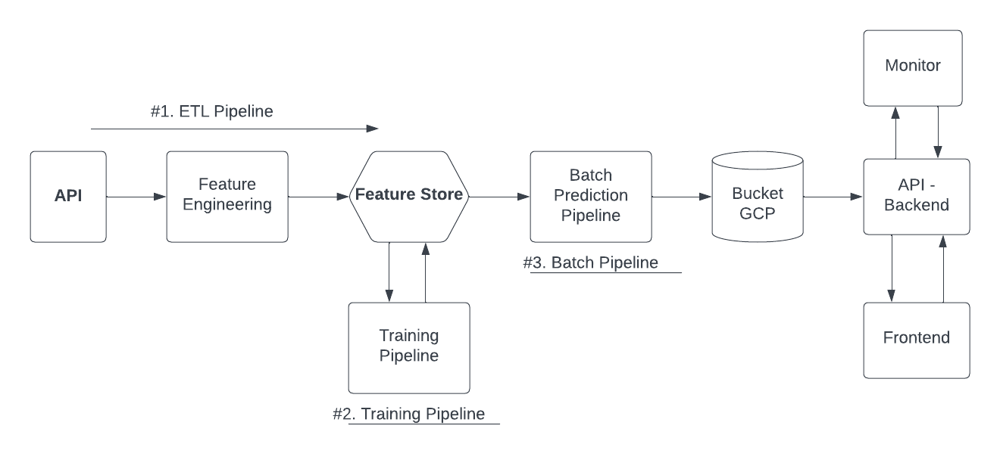
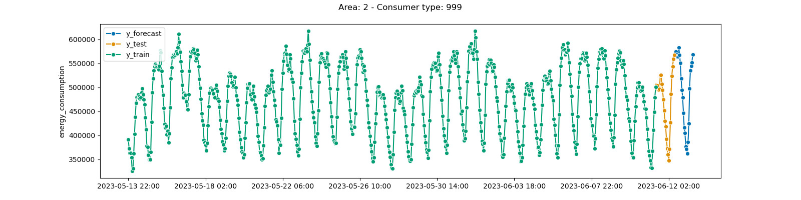
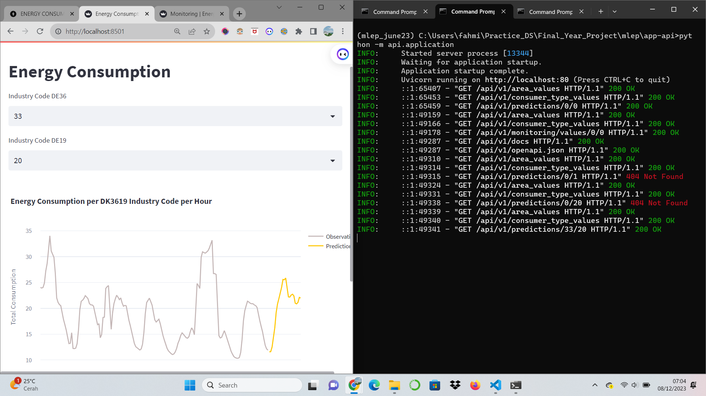

# Batch Architecture for Energy Consumption Forecasting
## Introduction

In this project, I will develop an ML model that can predict energy consumption levels based on data obtained from the [Energidataservice](https://www.energidataservice.dk/). The goal is to build a reliable and production-ready model that can accurately predict energy consumption levels for the next 24 hours across various consumer types in Denmark. By leveraging machine learning and best practices in MLOps, I aim to provide valuable insights for energy planning, resource optimization, and decision-making in the energy sector. 
 
#### Table of Contents
1. [Problem Statement](#problem-statement)
2. [Project Goals](#project-goals)
3. [Data Source](#data-source)
4. [Data Extraction, Transformation, and Loading (ETL)](#etl-pipeline)
5. [Model Development and Training](#model_training)
6. [Batch Prediction Pipeline](#batch-prediction)
7. [Monitoring and Maintenance](#monitor)
8. [References](#refrence)

## Problem Statement
Energy consumption levels are vital information in energy resource planning and management. However, accurate predictions of future energy consumption levels are crucial for optimizing energy production and distribution. Therefore, the main objective of this project is to build a model capable of predicting energy consumption levels for the next 24 hours with high accuracy. The model will consider various factors such as time, Industry Code DE36, and Industry Code DE19.

## Project Goals
The main objective of this project is to design, implement, deploy, and monitor a batch ML system that can predict energy consumption levels for the next 24 hours. By following best practices in MLOps, the aim is to create a production-ready model that is not only accurate but also scalable and easy to maintain. Throughout this project, the focus will be on building a reliable feature engineering pipeline, implementing efficient data processing techniques, and integrating necessary tools such as experiment tracking, model registry, feature store, and more. Below is a picture of the architecture.

## Data Source
The data for this project will be obtained from a web API provided by [Energidataservice](https://www.energidataservice.dk/tso-electricity/ConsumptionDK3619codehour).
This API provides detailed information on energy consumption levels for various consumer types in Denmark. The dataset includes timestamps, area information, consumer types, and energy consumption values. By leveraging this rich data source, I will be able to train and evaluate our ML model to accurately predict energy consumption levels.

**Notes**: Maybe you will be confused by some column names, but it's actually the same thing, because the old data has stopped since June 2023, you can see it [here](https://www.energidataservice.dk/tso-electricity/ConsumptionDE35Hour)

## Data Extraction, Transformation, and Loading (ETL)

In this project, the ETL steps performed include:

1. Accessing [Hopsworks](hopsworks.ai) and creating the "energy_consumption_mlep" project with a new API key.
2. Utilizing utility files and functions like utils.py to load JSON files and log activities.
3. Executing the ETL process through pipeline.py by calling functions from extract.py, transform.py, validation.py, and load.py. This includes extracting data from the API, transforming the data, and validating data quality.
4. Loading the transformed data into the feature store with the integration of Great Expectations for data quality validation.
5. Integrating the project with Hopsworks, utilizing the feature store, adding feature descriptions, and calculating statistics for each feature.
6. After that, to create a new feature view and training dataset version.

## Model Development and Training

In this stage, I will create a model using sktime and LightGBM for forecasting the next 24 hours. I will use W&B (Weights & Biases) to track experiments, model registry, track artifacts, and perform hyperparameter tuning to obtain the best model. Based on the best configuration found during the hyperparameter tuning step, I will train the final model on the entire dataset and save it to the Hopsworks model registry for further use in the batch prediction pipeline. The following are the steps:

1. Load data from the feature store:
    - Access the feature store.
    - Retrieve references to the feature view and dataset versions.
    - Record all metadata related to dataset splitting, along with some basic statistics for each split, such as size and feature distribution.
2. Model Creation:
    - Create a Baseline model.
    - Create a model using sktime and LightGBM.
    - Build a pipeline.
3. Hyperparameter Optimization
4. Select the best configuration 
5. Train the Model using the Best Configuration and save the best model in the Hopsworks model registry.

Tabel metrics with best model & experiments
| Model           |      MAPE       |      RMSPE     |
|-----------------|---------------- |----------------|
| baseline        |      0.1493     |     0.05767    |
| best_model      |      0.1467     |     0.06427    |

here example forecast:

## Batch Prediction Pipeline
In the batch pipeline there are several steps, namely:
- Load data from the feature store in batch mode
- Load the model from the model registry
- Make predictions and monitoring
- Saving the prediction in the Google Cloud Store Bucket

## Monitoring and Maintenance
build a FastAPI backend that will consume predictions and monitoring metrics from GCS and expose them via a RESTful API. More concretely, through a set of endpoints that will expose the data over HTTP(S).
- dashboards showing forecasts 
- dashboard showing monitoring metrics 

Both frontend applications will request data from the FastAPI RESTful API via HTTP and use Streamlit to render the data into multiple plots.

## Refrence<a name="refrence">
- [Data](https://www.energidataservice.dk/tso-electricity/ConsumptionDK3619codehour)
- [Article](https://towardsdatascience.com/a-guide-to-building-effective-training-pipelines-for-maximum-results-6fdaef594cee)
- [Validation](https://www.hopsworks.ai/post/data-validation-for-enterprise-ai-using-great-expectations-with-hopsworks)
- [GCP Bucket](https://cloud.google.com/storage/docs/creating-buckets)
- [Model Serving](https://medium.com/faun/key-concepts-for-model-serving-38ccbb2de372)
- [FastAPI-Path-Params](https://fastapi.tiangolo.com/tutorial/path-params/)

